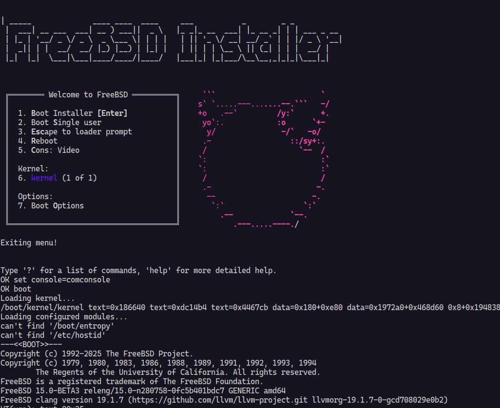

# FreeBSD-Up 🚀

A simple, zero-configuration script to quickly boot FreeBSD ISO images using
QEMU. Perfect for testing, development, or learning FreeBSD without complex
setup.



## ✨ Features

- 🔗 **Download and boot from URLs**: Automatically downloads ISO images from
  remote URLs
- 📁 **Local file support**: Boot from local ISO files
- 🏷️ **Version shortcuts**: Simply specify a version like `14.3-RELEASE` to
  auto-download
- 🎯 **Smart defaults**: Run without arguments to boot the latest stable release
  (FreeBSD 14.3-RELEASE)
- ⚡ **Zero configuration**: Works out of the box with sensible defaults
- 🖥️ **Serial console**: Configured for headless operation with stdio console
- 🌐 **Network ready**: Pre-configured with SSH port forwarding (host:2222 →
  guest:22)
- 💾 **Smart caching**: Automatically skips re-downloading existing ISO files
- 🆘 **Help support**: Built-in help with `--help` or `-h` flags
- ⚙️ **Configurable VM options**: Customize CPU type, core count, memory
  allocation, and persistent storage
- 💾 **Persistent storage support**: Attach disk images for data persistence
- 🗂️ **Multiple disk formats**: Support for qcow2, raw, and other disk formats
- 📝 **Enhanced CLI**: Powered by [Cliffy](http://cliffy.io/) for robust
  command-line parsing

## 📋 Prerequisites

Before using FreeBSD-Up, make sure you have:

- **[Deno](https://deno.com)** - Modern JavaScript/TypeScript runtime
- **[QEMU](https://www.qemu.org/)** - Hardware virtualization
- **KVM support** (Linux) - For hardware acceleration (optional but recommended)

### Installation on Common Systems

**Ubuntu/Debian:**

```bash
sudo apt-get update
sudo apt-get install qemu-system-x86 qemu-kvm
curl -fsSL https://deno.land/install.sh | sh
```

**Fedora:**

```bash
sudo dnf install qemu qemu-kvm
curl -fsSL https://deno.land/install.sh | sh
```

**macOS:**

```bash
brew install qemu deno
```

```bash
deno install -A -g -r -f --config deno.json ./main.ts -n freebsd-up
```

## 🚀 Quick Start

### Default Usage (Easiest)

Simply run without any arguments to boot the latest stable FreeBSD release:

```bash
./main.ts
```

This will automatically download and boot FreeBSD 14.3-RELEASE.

### Boot with Version Shortcut

Specify just a version to auto-download and boot:

```bash
./main.ts 14.3-RELEASE
./main.ts 15.0-BETA3
./main.ts 13.4-RELEASE
```

### Boot from URL

Download and boot from a specific URL:

```bash
./main.ts https://download.freebsd.org/ftp/releases/amd64/amd64/ISO-IMAGES/15.0/FreeBSD-15.0-BETA3-amd64-disc1.iso
```

### Boot from Local File

```bash
./main.ts /path/to/your/freebsd.iso
```

### Customize VM Configuration

Specify custom CPU type, core count, memory allocation, and persistent storage:

```bash
# Custom CPU and memory
./main.ts --cpu host --memory 4G 14.3-RELEASE

# Specify number of CPU cores
./main.ts --cpus 4 --memory 8G 15.0-BETA3

# Attach a disk image for persistent storage
./main.ts --drive ./freebsd-disk.img --disk-format qcow2 14.3-RELEASE

# Download to specific location
./main.ts --output ./downloads/freebsd.iso 15.0-BETA3

# Combine all options
./main.ts --cpu qemu64 --cpus 2 --memory 1G --drive ./my-disk.qcow2 --disk-format qcow2 --output ./my-freebsd.iso
```

### Get Help

```bash
./main.ts --help
# or
./main.ts -h
```

### Alternative Execution Methods

If the script isn't executable, you can run it directly with Deno:

```bash
deno run --allow-run --allow-read --allow-env main.ts [options]
```

## 🔧 Command Line Options

FreeBSD-Up supports several command-line options for customization:

- `-c, --cpu <type>` - CPU type to emulate (default: `host`)
- `-C, --cpus <number>` - Number of CPU cores (default: `2`)
- `-m, --memory <size>` - Amount of memory for the VM (default: `2G`)
- `-d, --drive <path>` - Path to VM disk image for persistent storage
- `--disk-format <format>` - Disk image format: qcow2, raw, etc. (default:
  `raw`)
- `-o, --output <path>` - Output path for downloaded ISO files
- `-h, --help` - Show help information
- `-V, --version` - Show version information

### Examples

```bash
# Use different CPU type
./main.ts --cpu qemu64 14.3-RELEASE

# Allocate more memory
./main.ts --memory 4G 15.0-BETA3

# Use more CPU cores
./main.ts --cpus 4 14.3-RELEASE

# Attach a persistent disk image
./main.ts --drive ./freebsd-storage.qcow2 --disk-format qcow2 14.3-RELEASE

# Save ISO to specific location
./main.ts --output ./isos/freebsd.iso https://example.com/freebsd.iso

# Combine multiple options with persistent storage
./main.ts --cpu host --cpus 4 --memory 8G --drive ./vm-disk.qcow2 --disk-format qcow2 --output ./downloads/ 14.3-RELEASE
```

## 🖥️ Console Setup

When FreeBSD boots, you'll see the boot menu. For the best experience with the
serial console:

1. **Select option `3. Escape to loader prompt`**
2. **Configure console output:**
   ```
   set console="comconsole"
   boot
   ```

This enables proper console redirection to your terminal.

## ⚙️ VM Configuration

The script creates a VM with the following default specifications:

- **CPU**: Host CPU with KVM acceleration (configurable with `--cpu`)
- **Memory**: 2GB RAM (configurable with `--memory`)
- **Cores**: 2 virtual CPUs (configurable with `--cpus`)
- **Storage**: ISO-only by default; optional persistent disk (configurable with
  `--drive`)
- **Network**: User mode networking with SSH forwarding
- **Console**: Enhanced serial console via stdio with proper signal handling
- **Default Version**: FreeBSD 14.3-RELEASE (when no arguments provided)

### Available CPU Types

Common CPU types you can specify with `--cpu`:

- `host` (default) - Use host CPU features for best performance
- `qemu64` - Generic 64-bit CPU for maximum compatibility
- `Broadwell` - Intel Broadwell CPU
- `Skylake-Client` - Intel Skylake CPU
- `max` - Enable all supported CPU features

### Available Disk Formats

Common disk formats you can specify with `--disk-format`:

- `raw` (default) - Raw disk image format for maximum compatibility
- `qcow2` - QEMU Copy On Write format with compression and snapshots
- `vmdk` - VMware disk format
- `vdi` - VirtualBox disk format

## 🔧 Customization

### Modifying VM Settings via Command Line

The easiest way to customize VM settings is through command-line options:

```bash
# Increase memory to 4GB
./main.ts --memory 4G

# Use a different CPU type
./main.ts --cpu qemu64

# Increase CPU cores to 4
./main.ts --cpus 4

# Add persistent storage
./main.ts --drive ./freebsd-data.qcow2 --disk-format qcow2

# Combine options with persistent storage
./main.ts --cpu host --cpus 4 --memory 8G --drive ./vm-storage.qcow2 --disk-format qcow2 14.3-RELEASE
```

### Creating Disk Images

Before using the `--drive` option, you may need to create a disk image:

```bash
# Create a 20GB qcow2 disk image
qemu-img create -f qcow2 freebsd-data.qcow2 20G

# Create a 10GB raw disk image
qemu-img create -f raw freebsd-data.img 10G
```

### Advanced Customization

To modify other VM settings, edit the QEMU arguments in the `runQemu` function
in `main.ts`:

```typescript
const cmd = new Deno.Command("qemu-system-x86_64", {
  args: [
    "-enable-kvm",
    "-cpu",
    options.cpu,
    "-m",
    options.memory,
    "-smp",
    options.cpus.toString(), // Number of CPU cores
    "-chardev",
    "stdio,id=con0,signal=off", // Enhanced console handling
    "-serial",
    "chardev:con0",
    // Conditional drive attachment for persistent storage
    ...(options.drive
      ? [
        "-drive",
        `file=${options.drive},format=${options.diskFormat},if=virtio`,
      ]
      : []),
    // ... other options
  ],
  // ...
});
```

### Supported Version Formats

The script automatically recognizes and handles these version formats:

- `14.3-RELEASE` - Stable releases
- `15.0-BETA3` - Beta versions
- `13.4-RC1` - Release candidates
- Any format matching: `X.Y-RELEASE|BETAX|RCX`

To change the default version when no arguments are provided, modify the
`DEFAULT_VERSION` constant in `main.ts`.

## 📁 Project Structure

```
freebsd-up/
├── main.ts          # Main script with Cliffy CLI integration
├── deno.json        # Deno configuration with dependencies
├── deno.lock        # Dependency lock file
└── README.md        # This file
```

### Dependencies

The project uses the following key dependencies:

- **[@cliffy/command](https://jsr.io/@cliffy/command)** - Modern command-line
  argument parsing
- **[chalk](https://www.npmjs.com/package/chalk)** - Terminal styling and colors

## 🤝 Contributing

Contributions are welcome! Feel free to:

- Report bugs
- Suggest features
- Submit pull requests
- Improve documentation

## 📝 License

This project is open source. Check the repository for license details.

## 🔗 Useful Links

- [FreeBSD Downloads](https://www.freebsd.org/where/)
- [QEMU Documentation](https://www.qemu.org/docs/master/)
- [Deno Manual](https://docs.deno.com/runtime/)
- [Cliffy Command Documentation](https://cliffy.io/docs@v1.0.0-rc.8/command/)

---

> [!NOTE]
>
> This tool is designed for development and testing purposes. For production
> FreeBSD deployments, consider using proper installation methods.
